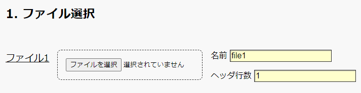
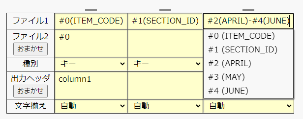
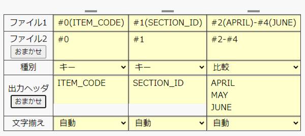

# CSV Comparator

[CSV Comparator](https://nishihara-daiki.github.io/csv-comparator/) は、2つのCSVファイルを行単位で比較するツールです。

ローカルのブラウザ内で動作するため、ファイルは外部に送信されません。


## 使用例

例として、次の2つのファイルを使用します。

[a.csv](materials/a.csv)（ヘッダ1行）
```csv
ITEM_CODE,SECTION_ID,APRIL,MAY,JUNE
102500,230,1000,1080,1090
102500,260,2000,1090,4590
102600,230,2600,1090,4590
102700,230,5000,5020,6070
102700,260,5700,4900,4900
```

[b.csv](materials/b.csv)（ヘッダ2行）
```csv
商品コード,セクションID,4月,5月,6月
ITEM_CODE,SECTION_ID,APRIL,MAY,JUNE
102500,230,1000,1080,1090
102500,260,2000,1090,4590
102600,230,2600,1090,4690
102700,230,5000,5020,6070
102800,230,5020,5100,4090
```

まず、使用する文字コードを設定します。比較するCSVや設計JSONファイルで共通の設定です。


### 1. ファイルを選択

ファイル1をアップロードします。

1. 「ファイルを選択」から `a.csv` を選択します。
1. 自動で、プレビュー画面に読み込まれます。
1. 「名前」は自動的にファイル名の `a` が入力されますが、好きな名前に変更可能です。
1. ヘッダ行数を指定します。今回は `1` です。

アップロード前の図


ファイル2も同様です。ただし、`b.csv` はヘッダが2行あるため、「ヘッダ行数」は `2` とします。

アップロード後の図



### 2. カラム設計

比較する行を定義します。

例では、0列目の `ITEM_CODE`、1列目の `SECTION_ID` の列をキーとして2つのファイルを比較します。（列数は0から数えます）

比較対象は 2列目の `APRIL`、3列目の `MAY`、4列目の `JUNE` です。


1. カラム数を増やします。「増やす」ボタンを2回クリックして、3列にします。
1. 「ファイル1」の行から埋めていきます。キーボードで `#0`、`#1`、... と入力しても構いませんが（※図では `#0(ITEM_CODE)` としていますが、単に `#0` としても構いません）、入力欄をクリックするとサジェスト表示されるので、クリック操作での入力もできます。「ファイル1」行の3つ目は、`#2(APRIL)-#4(JUNE)`（もしくは `#2-#4`）と入力しています。これは、2列目から4列目を表しています（カラム数を増やして個別に、`#2`、`#3`、`#4` と入力しても構いません）。

1. 「ファイル2」の行を埋めます。「おまかせ」ボタンを押すと、ファイル1とファイル2のヘッダを見比べて自動で補完されます。
1. 「種別」の行を埋めます。図のように、「キー」「キー」「比較」を選択します。

1. 「出力ヘッダ」の行を埋めます。「おまかせ」ボタンを押すと、ファイル2のヘッダ情報を見て自動で補完されます。




### 3. 実行

「比較実行」ボタンを押すと、比較結果が表示されます。


* 白い部分は、変化がないことを示しています。
* 緑色は追加、赤色は削除を示しています。例えば、`JUNE`列の中央行付近では、`a` の `4590` が、`b` の `4690` に変わっていることを示しています。
* 行全体が赤の部分は、`a`のみにキーが存在することを示しています。
* 行全体が緑の部分は、`b`のみにキーが存在することを示しています。


## 仕様（全ての機能）

各項目ごとに仕様を説明します。

#### 文字コード

文字コードは `Shift_JIS` または `UTF-8` を選択できます。文字コードは、比較するCSVファイルや設計JSONファイルで共通である必要があります。


### 1. ファイル選択

#### [ファイル1, ファイル2] > ファイルを選択

比較するファイルを選択します。「ファイルを選択」ボタンでファイルを選択するか、ファイルを直接ドラッグ＆ドロップして指定します。


#### [ファイル1, ファイル2] > 名前

最終的な比較結果で使用されます。
ファイルを選択すると、自動的にファイル名（拡張子を除く）が入力されますが、任意の名前に変更できます。


#### [ファイル1, ファイル2] > ヘッダ行数

ファイル中で、ヘッダと見なす行数を指定します。


#### [ファイル1, ファイル2] > 高度な設定 > フィルタ

無視する行の条件を指定できます。
言語は JavaScript で、評価値が `true` であればその行を残し、`false` であれば省略します。
行の各要素は、配列名 `a` （長さは行の要素数）でアクセスできます。

例えば、0列目と3列目のどちらかが空白である行を読み飛ばす場合は次のように記述します。
```js
a[0] != '' && a[3] != ''
```


### カラム設計

2つのファイルの列の対応を定義します。


#### 設計 > 列を「増やす」ボタン

表の入力欄を右端に追加します。


####  設計 > 列を「減らす」ボタン

表の最右の入力欄を削除します。


####  設計 > 表 > ファイル1

ファイル1の列を指定します。

書式は3種類あります。
* 単一列指定 `#n` または `#n(s)`（`n`は列数を表す整数、`s`は任意の文字列）
* 連続列指定 `#n-#m` または `#n(s)-#m(t)`（`n`、`m`は列数を表す整数、`s`、`t`は任意の文字列）
* 式指定 `=e` （`e`は JavaScript による数式であり、第`n`列は `#n` または `a[n]` で参照可能）

単一列指定では、1列のみを指定します。

連続列指定では、連続した複数の列を指定できます。例えば、2列目から5列目の場合は `#2-#5` と書きます。単一列指定で個別に `#2`、`#3`、`#4`、`#5` とした場合と等価です。

式指定では、任意の式を記述出来ます。例えば3列目と5列目の和を表す場合は、`=#3+#5` または `=a[3]+a[5]` と書きます。列が `#n` で参照できることを除けば JavaScript の書式に従います（ここに書かれたコードは、`#n` を `a[n]` に置換したのち、`eval()`で評価して直接埋め込みます）。


####  設計 > 表 > ファイル2

以下の点を除き、ファイル1と同様です。
* 「おまかせ」ボタンを押すと、ファイル1の列名とファイル2の列名を比較し、ファイル1の列番号に対応すると推測されるファイル2の列番号を自動で入力します。推測に失敗した場合は入力されません。
* 連続列指定では、ファイル1と同じ列数である必要があります。


####  設計 > 表 > 種別

各列の役目を指定します。以下の4種類があります。
* キー：ファイル1とファイル2の比較行を決めるためのキーとして扱います。複数の列をキーとしても構いませんが、キーで唯一の行が指定できる必要があります（キーの重複はできません）。
* 比較：2つのファイルで一致しているかどうか比較します。
* 表示：最終的な結果に表示させる列で、比較の動作に関与しません。
* 無効：キー、比較、表示のいずれとしても扱いません（記述していないのと等価です）。


####  設計 > 表 > 出力ヘッダ

比較結果を出力する際のヘッダ名を記述します。任意の名前を指定できます。「おまかせ」ボタンを押すと、可能な限りファイル2のヘッダの一番下を自動で入力します。


####  設計 > 表 > 文字揃え

比較結果を出力する際の文字揃えを選択できます。「自動」を選択すると、種別がキーの場合は左揃え、その他の場合は数値であれば右揃え、数値でなければ左揃えとなります。


####  設計の保存/読み込み > ダウンロード

設計の表を保存できます。保存形式は後述のJSON形式です。


#### 設計の保存/読み込み > ファイルを選択

以前に保存した設計JSONファイルを読み込みできます。ファイルを選択すると、ファイルの内容に合わせて設計の表が上書き更新されます。


#### 設計JSONファイルの形式

設計表の列ごとに、次のキーで定義されるオブジェクトを作り、列数に合わせたリストで表記します。

* `cdt-file1` (string): ファイル1の列を指定します。
* `cdt-file2` (string): ファイル2の列を指定します。
* `cdt-type` (string): 種別を指定します。{`key` (キー), `compare` (比較), `show` (表示), `disable` (無効)}から選択します。
* `cdt-header` (string): 出力ヘッダを指定します。改行コードは `\n` を使用します。
* `cdt-align` (string): 文字揃えを指定します。{`auto` (自動), `left` (左揃え), `center` (中央揃え), `right` (右揃え)}から選択します。

例えば、次の設計表は、次の設計JSONで記述できます。


```json
[
    {
        "cdt-file1": "#0(ITEM_CODE)",
        "cdt-file2": "#0",
        "cdt-type": "key",
        "cdt-header": "ITEM_CODE",
        "cdt-align": "auto"
    },
    {
        "cdt-file1": "#1(SECTION_ID)",
        "cdt-file2": "#1",
        "cdt-type": "key",
        "cdt-header": "SECTION_ID",
        "cdt-align": "auto"
    },
    {
        "cdt-file1": "#2(APRIL)-#4(JUNE)",
        "cdt-file2": "#2-#4",
        "cdt-type": "compare",
        "cdt-header": "APRIL\nMAY\nJUNE",
        "cdt-align": "auto"
    }
]
```


### 実行

#### 比較実行

比較を実行します。
ファイルやカラム設計を変更した場合は、再度クリックすれば更新されます。


#### 表をクリップボードにコピー

「比較実行」で表示されている結果をクリップボードにコピーします。


#### 結果

* 白い部分は、変化がないことを示しています。「一致行も表示する」のチェックを外して実行すると、行全体が白い行が省略されます。
* 緑色は追加、赤色は削除を示しています。
* 行全体が赤の部分は、`a`のみにキーが存在することを示しています。「キーがファイル1のみに存在する行も表示する」のチェックを外して実行すると省略されます。
* 行全体が緑の部分は、`b`のみにキーが存在することを示しています。「キーがファイル2のみに存在する行も表示する」のチェックを外して実行すると省略されます。


#### 左右に並べて表示する（入力の全てのカラムも追加する）

* 「左右に並べて表示する（入力の全てのカラムも追加する）」のチェックを入れて実行すると、ファイル1とファイル2を列ごとに左右に並べた形式で表示します。
* キーがファイル1またはファイル2の片方のみに存在する場合は、その片方のみを表示し、他方は空欄で表示します。
* カラム設計で指定した列に加えて、元の入力ファイルの全てのカラムを表示します。
